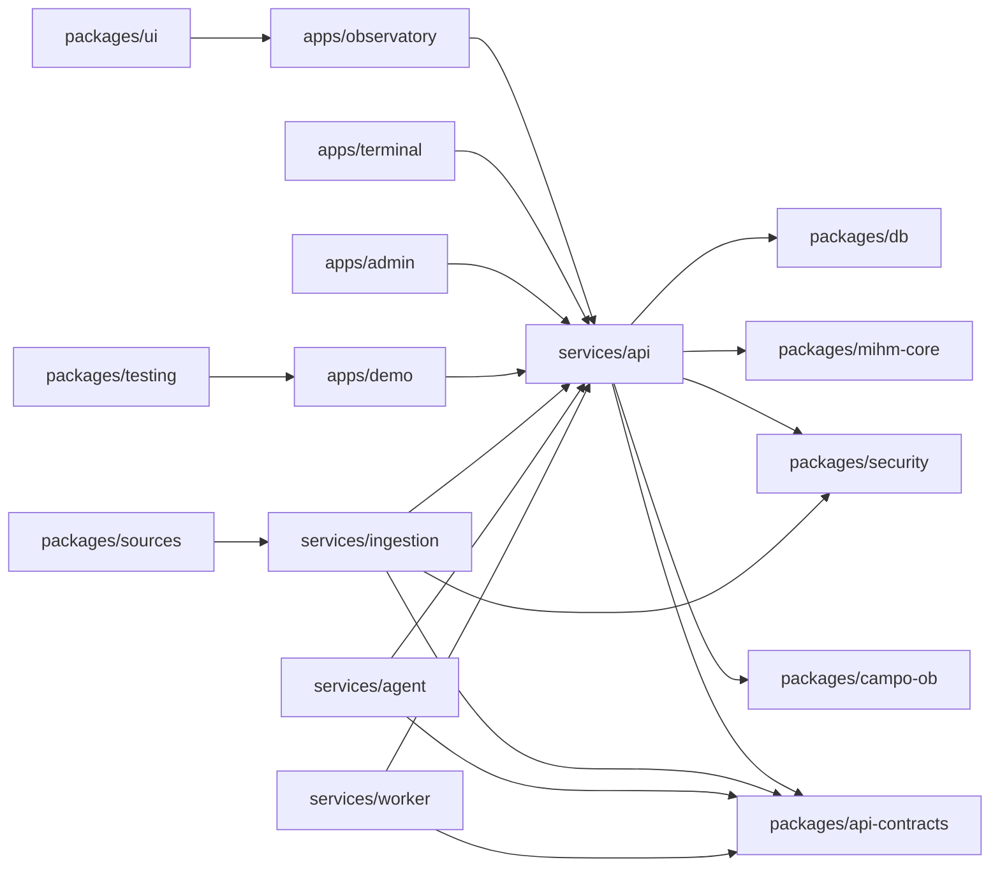

# MONOREPO TARGET ARCHITECTURE

Fecha: 2026-05-21  
Fase ejecutada: FASE 2A - andamiaje constitucional minimo  
Frase rectora: construir para coherencia computacional, no para apariencia.

## Alcance

Este documento propone la migracion a monorepo limpio sin ejecutar migracion de logica productiva.

FASE 2A crea solo:

- estructura destino;
- paquetes vacios con responsabilidad declarada;
- tipos base;
- contratos minimos;
- limites constitucionales;
- reporte de validacion.

FASE 2A no hace:

- mover codigo productivo;
- tocar `/terminal`;
- tocar auth;
- tocar Supabase;
- tocar `.env`;
- modificar APIs existentes;
- conectar fuentes externas;
- implementar Evaluator;
- reescribir sistema actual.

## Principio arquitectonico

Los futuros aplicativos independientes consumen el Observatorio SFI mediante `services/api` y contratos publicados en `packages/api-contracts`.

Ningun aplicativo accede directamente a base de datos.

La UI solo consume:

- `FieldState`;
- `NodeState`;
- `Logs`;
- `SourceHealth`.

La verdad del campo se calcula en Field Core, no en Interface Core.

## Estructura destino

```text
apps/
  observatory/
  terminal/
  admin/
  demo/
services/
  api/
  ingestion/
  agent/
  worker/
packages/
  mihm-core/
  campo-ob/
  security/
  db/
  sources/
  ui/
  api-contracts/
  config/
  testing/
docs/
```

## Apps

### `/apps/observatory`

Dashboard principal del observatorio. Es la consola constitucional del agente.

Responsabilidad:

- renderizar estado del campo;
- mostrar bitacoras y salud de fuentes;
- consumir contratos del observatorio;
- enviar comandos a `services/api`.

Limite:

- no calcula verdad del campo;
- no accede directo a DB;
- no reemplaza rutas actuales en FASE 2A.

### `/apps/terminal`

Interfaz viva de campo. Puede existir separada si se justifica; si no, queda como ruta dentro `apps/observatory`.

Decision FASE 2A:

- se crea carpeta separada para conservar opcion arquitectonica;
- no se toca `/terminal` productivo actual;
- queda sin implementacion.

### `/apps/admin`

Consola de administracion, seguridad, usuarios, roles y auditoria.

Responsabilidad:

- operar seguridad y administracion fuera del dashboard constitutivo;
- mostrar audit trails;
- coordinar funciones root/system con trazabilidad.

### `/apps/demo`

Entorno demostrativo con fixtures declarados.

Responsabilidad:

- demostrar flujos sin datos reales;
- usar datos `fixture` o `simulated`;
- no conectar fuentes externas.

## Services

### `/services/api`

API principal del observatorio.

Responsabilidad:

- exponer `FieldState`, `NodeState`, `Logs` y `SourceHealth`;
- recibir comandos desde apps;
- aplicar `packages/security`;
- ser la unica puerta de apps hacia repositorios.

Regla:

- ninguna app futura consume `packages/db` directamente.

### `/services/ingestion`

Ingesta de fuentes externas.

Responsabilidad:

- convertir webhooks, cron, OAuth o APIs publicas en `SourceEvent`;
- validar fuente, firma, timestamp e idempotencia;
- no escribir directamente verdad del campo.

### `/services/agent`

Agente SFI: memoria, propuestas, limites y autoconocimiento operacional.

Responsabilidad:

- consumir estado del observatorio;
- emitir propuestas o inferencias trazables;
- etiquetar toda inferencia con evidencia y confianza.

Regla:

- nada finge conciencia;
- CognitiveTwin no entra al core hasta demostrar funcionalidad.

### `/services/worker`

Jobs, recompute, degradacion y health checks.

Responsabilidad:

- ejecutar trabajos autorizados;
- recalcular estados derivados;
- reportar salud de fuentes y degradacion operacional.

## Packages

### `/packages/mihm-core`

Tipos, formulas, estados, taxonomia y leyes computables.

FASE 2A:

- declara `MihmMetricKey`, `MihmRegime`, `MihmVector`, `MihmComputationInput`, `MihmComputationResult`.

No implementa formulas productivas.

### `/packages/campo-ob`

CAMPO-OB: bitacoras, nodos, vinculos y regimen.

FASE 2A:

- declara `FieldState`;
- declara `NodeState`;
- declara `LogRecord`;
- declara `SourceHealth`;
- declara categorias de fuente/evidencia.

### `/packages/security`

Zero Trust, RBAC/ABAC, policy engine y audit helpers.

FASE 2A:

- declara `ActorRole`;
- declara `ActorContext`;
- declara `PolicyDecision`;
- declara `AuditEvent`.

No modifica auth existente.

### `/packages/db`

Repositorios, schemas, migrations y Supabase/Postgres.

FASE 2A:

- declara frontera de repositorio;
- documenta que apps no pueden acceder directo a DB.

No toca migraciones existentes.

### `/packages/sources`

Adaptadores de fuentes externas.

FASE 2A:

- declara `SourceAdapterDescriptor`;
- no conecta ninguna fuente.

### `/packages/ui`

Componentes visuales compartidos.

FASE 2A:

- declara `ViewState`;
- declara `DisplayBoundary` con `mayComputeFieldTruth: false`.

### `/packages/api-contracts`

Contratos de API/eventos.

FASE 2A:

- declara `CommandRequest`;
- declara `SourceEvent`;
- declara `ApiResult`;
- versiona contrato como `2026-05-21.phase-2a`.

### `/packages/config`

Configuracion compartida.

FASE 2A:

- declara shape de config;
- no lee `.env`.

### `/packages/testing`

Fixtures, mocks y helpers.

FASE 2A:

- declara fixtures con `fixture` o `simulated`;
- no usa datos productivos.

## Flujo soberano destino



## Politica de acceso a datos

Permitido:

- apps consumen `services/api`;
- services usan `packages/api-contracts`;
- `services/api` coordina acceso a `packages/db`;
- `packages/db` encapsula repositorios y migrations futuras;
- `packages/security` decide autorizacion antes de comandos.

Prohibido:

- apps accediendo directo a DB;
- UI calculando `FieldState`;
- ingestion escribiendo verdad del campo sin API;
- agent escribiendo decisiones sin policy;
- demo usando datos reales;
- sources conectando APIs sin `services/ingestion`.

## Estado de FASE 2A

Se creo el andamiaje de carpetas y tipos base. No hay build orchestration, workspaces ni dependencias nuevas. Esa decision es intencional: agregar workspaces o mover codigo seria una fase posterior con autorizacion explicita.

## Fases posteriores propuestas, no ejecutadas

1. FASE 2B: agregar configuracion de workspaces sin mover codigo productivo.
2. FASE 2C: extraer contratos reales desde endpoints existentes hacia `packages/api-contracts`.
3. FASE 2D: crear API gateway versionado junto a APIs actuales, sin reemplazarlas.
4. FASE 2E: migrar solo consumidores UI hacia contratos canonicos.
5. FASE 2F: aislar CognitiveTwin como package experimental con tests de trazabilidad.
