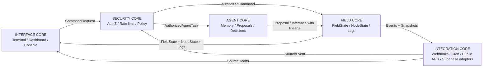

# PROCESS MAP

Fecha: 2026-05-21  
Fase: FASE 1 - mapa de procesos y separacion del campo  
Regla rectora: ningun proceso de interface calcula verdad del campo. La UI solo consume `FieldState`, `NodeState`, `Logs` y `SourceHealth`.

## Objetivo

Este documento separa los procesos actuales del repo en cinco dominios operativos:

1. `FIELD CORE`
2. `AGENT CORE`
3. `SECURITY CORE`
4. `INTERFACE CORE`
5. `INTEGRATION CORE`

La separacion no describe la arquitectura ideal como si ya existiera. Describe donde viven hoy los procesos, que responsabilidad real tienen y que frontera deben respetar en la migracion limpia del Observatorio SFI.

## Contratos canonicos del observatorio

La base limpia debe hacer que todo aplicativo, dashboard o modulo externo consuma estados canonicos, no calculos visuales.

| Contrato | Contenido | Productor permitido | Consumidor permitido | Nota |
|---|---|---|---|---|
| `FieldState` | Regimen, degradacion, capacidad operativa, activaciones, vectores MIHM, salud del campo. | FIELD CORE | INTERFACE, AGENT, INTEGRATION | Fuente de verdad del campo. |
| `NodeState` | Nodo activo, ownership, assets SFI, vinculos, memoria minima asociada. | FIELD CORE + SECURITY CORE | INTERFACE, AGENT | No debe ser inventado en cliente. |
| `Logs` | Bitacora, event stream, audit trail, logbook SFI, eventos de seguridad. | FIELD CORE + SECURITY CORE + INTEGRATION | INTERFACE, AGENT | Debe distinguir observado/declarado/inferido/simulado. |
| `SourceHealth` | Estado de Supabase, webhooks, cron, fuentes externas, snapshots WorldSpect, conectores. | INTEGRATION CORE + SECURITY CORE | INTERFACE, FIELD CORE | No equivale a verdad; solo disponibilidad/calidad de fuente. |

## Frontera dura de interface

Procesos que hoy estan en UI pero calculan o mutan "verdad" deben migrar o degradarse:

- `src/observatory/store/pulseEngine.ts`: calcula metricas y efectos de senales. Debe moverse a FIELD CORE o quedar como simulacion visual no persistente.
- `src/observatory/hooks/useTelemetryPulse.ts`: genera pulsos cada 16s en cliente. No debe producir verdad del campo; solo puede solicitar refresh o mostrar heartbeat local.
- `src/observatory/store/nodeStore.ts`: mezcla estado visual, snapshots localStorage, bootstrap remoto y metricas. Debe dividirse en `FieldStateViewModel` y cliente de contratos.
- `src/observatory/components/field/SfiFieldShell.tsx`: hoy dispara persistencias, ranking, lectura WorldSpect y comandos. Debe quedar como consola/render; los calculos deben venir de APIs o paquetes core.
- Cualquier componente visual que use localStorage como historia operacional debe marcarlo como cache local, no bitacora.

## Dominio 1 - FIELD CORE

Responsabilidad: calcular y persistir el estado del campo. Incluye senales, nodos, vinculos, regimen, degradacion, capacidad operativa y bitacoras.

| Proceso actual | Ruta | Responsabilidad actual | Datos produce | Datos consume | Estado objetivo | Accion |
|---|---|---|---|---|---|---|
| Nodo constitutivo | `src/app/api/node/bootstrap/route.ts` | Hidrata nodo, perfil, audits, memory facts, actions, licenses, SFI assets. | `NodeState` inicial, assets, facts, actions. | Usuario Supabase, `nodes`, `profiles`, `audits`, `memory_facts`, `actions`, `licenses`. | FIELD CORE + SECURITY boundary | Mantener como `GET /field/node-state` versionado. |
| Ownership de nodo | `src/lib/server/productionBackend.ts` | Crea contexto usuario/perfil/root y asegura nodo propio. | Contexto autorizado y nodo propietario. | Supabase auth, `profiles`, `nodes`. | SECURITY CORE usado por FIELD CORE | Migrar a auth/context package. |
| SFI assets | `src/app/api/sfi/assets/route.ts` | Lista/crea activos SFI y registra logbook. | `sfi_assets`, `sfi_logbook`. | Usuario, licencia, entitlements, payload asset. | FIELD CORE | Mantener con schema fuerte. |
| SFI measurements | `src/app/api/sfi/assets/[asset_id]/measurements/route.ts` | Registra mediciones por asset. | `sfi_measurements`, `sfi_logbook`. | Asset, usuario, medicion. | FIELD CORE | Mantener como comando trazable. |
| Field persistence multiplexor | `src/app/api/field/persist/route.ts` | Persiste eventos de campo, logbook, snapshots, drafts, social returns, runtime status. | `cognitive_event_stream`, `sfi_logbook`, `world_spectrum_snapshots`, `media_drafts`, `social_posts`, `social_resonance_events`. | Body `action`, node, user, social tokens. | FIELD CORE dividido | Reescribir en comandos separados. |
| Event stream | `cognitive_event_stream` en `src/lib/supabase/migrations/01_full_script.sql` | Ledger de eventos por nodo. | Secuencia de eventos con payload y correlacion. | Field persist, liturgia, social, auth threshold. | FIELD CORE | Convertir en event store canonico con schemas. |
| Logbook SFI | `sfi_logbook` en migraciones y `src/lib/server/sfiAssets.ts` | Bitacora por asset SFI. | Eventos operativos hashados. | Assets, measurements, field events. | FIELD CORE | Mantener como ledger de asset. |
| Field vector scoring | `src/observatory/field/vectorScoring.ts` | Calcula activacion de nodos por patrones, senal usuario, MIHM y trazabilidad. | Activacion de nodos. | Pattern rank, node vectors, user signal. | FIELD CORE | Migrar fuera de UI; exponer como servicio puro. |
| Pattern activation | `src/observatory/field/patternActivation.ts` | Rankea patrones por comando, nodo, modo, eventos recientes. | `PatternRankResult`. | Comando, nodo, eventos, patrones. | FIELD CORE | Mantener como motor determinista con tests. |
| Pattern model | `src/observatory/field/patternModel.ts` y docs relacionados | Define patrones, fricciones y acciones sugeridas. | Catalogo de patrones. | N/A | FIELD CORE | Migrar como data/versioned rules. |
| Deduplicacion de eventos | `src/observatory/runtime/deduplicateFieldEvents.ts` | Deduplica eventos recientes en memoria de proceso/cliente. | Decision de persistencia, hash. | Eventos field/social. | FIELD CORE | Reescribir server-side con idempotency keys. |
| WorldSpect trigger local | `src/observatory/worldspect/detectWorldSpectTriggers.ts` | Detecta necesidad de lectura WorldSpect. | Triggers y variables. | Comando, nodo, MIHM, eventos. | FIELD CORE | Mantener, pero no fingir dato externo. |
| WorldSpect reading builder | `src/observatory/worldspect/buildWorldSpectReading.ts` | Construye lectura local con source descriptor limitado. | Lectura `LOCAL_CONTEXT`. | Trigger, patrones, MIHM. | FIELD CORE | Mantener como lectura derivada, no fuente externa. |
| WorldSpect global snapshot | `src/app/api/worldspect/global/route.ts` + `src/observatory/worldspect/globalWorldSpect.ts` | Devuelve ultimo snapshot medido o `missing`. | `SourceHealth` y snapshot medido. | `world_spectrum_snapshots`. | FIELD CORE lee INTEGRATION | Mantener con acceso controlado. |
| UI pulse metrics actuales | `src/observatory/store/pulseEngine.ts`, `useTelemetryPulse.ts` | Calcula IHG/NTI/LDI locales y los altera por intervalos. | Metricas locales y snapshots. | Estado cliente. | No debe quedar en INTERFACE | Migrar a FIELD CORE o marcar `visual_estimate`. |

### Salida canonica FIELD CORE

```ts
type FieldState = {
  fieldId: string;
  nodeId: string;
  regime: 'stable' | 'watch' | 'critical' | 'unknown';
  metrics: {
    ihg: number;
    nti: number;
    ldi: number;
    phi?: number;
    degradation?: number;
    operationalCapacity?: number;
  };
  activePatterns: Array<{ id: string; score: number; evidence: string[] }>;
  activeLinks: Array<{ sourceNodeId: string; targetNodeId: string; relation: string }>;
  sourceState: 'observed' | 'declared' | 'derived' | 'inferred' | 'simulated';
  confidence: number;
  updatedAt: string;
};
```

## Dominio 2 - AGENT CORE

Responsabilidad: procesos del agente: memoria, decisiones, propuestas, limites, autoconocimiento operativo y CognitiveTwin solo si es funcional/trazable.

| Proceso actual | Ruta | Responsabilidad actual | Datos produce | Datos consume | Estado objetivo | Accion |
|---|---|---|---|---|---|---|
| Memory facts | `src/lib/memory/facts.ts` | Extrae facts desde auditorias/resultados. | `memory_facts`. | Narrativa, audit result. | AGENT CORE | Mantener si agrega evidencia y fuente. |
| Memory vectors | `src/lib/memory/embeddings.ts` | Guarda contenido en `memory_vectors` con embedding null. | Vector record incompleto. | Content, source. | AGENT CORE experimental | Completar provider o no migrar como vector real. |
| Liturgia AMV | `src/app/api/liturgia/amv/route.ts` | Responde mensajes y registra sesiones/eventos/memory facts. | `amv_sessions`, `amv_messages`, `cognitive_event_stream`, `memory_facts`. | Nodo, mensaje, facts, audits. | AGENT CORE | Reescribir con politica de no-conciencia y lineage. |
| AMV routes legacy | `src/app/api/amv/session`, `src/app/api/amv/respond` | Via `createKernelRoute`. | Resultado kernel generico. | Body arbitrario. | AGENT CORE no confiable | Reescribir o clausurar. |
| Runtime decision kernel | `src/runtime/kernel/systemTick.ts` | Obtiene intent, genera planes, simula, gatea, ejecuta y registra. | Gate logs, actions, observations. | Metrics, intents, Supabase. | AGENT CORE experimental | Aislar detras de feature flag y schemas. |
| Runtime layers | `src/runtime/layers` | Intent, planner, simulator, gate, executor, observer. | Planes, simulaciones, ejecuciones, observaciones. | Intents, metrics, ERW. | AGENT CORE experimental | Separar simulacion de decision real. |
| Agents TS | `src/agents` | Auditor, longitudinal, pattern engine, world-spectrum, stochastic, cultural-feeling, etc. | Analisis, audits, weights, lecturas. | Supabase, prompts, nodos. | AGENT CORE / FIELD CORE mixto | Auditar uno por uno antes de migrar. |
| CognitiveTwin API actual | `src/app/api/cognitive-twin/route.ts` | Genera reading heuristico con `observatory/operational/analysis`, no invoca Python. | `reading`, `cognitiveVector`, log en memoria. | FormData text/file. | AGENT CORE experimental | Renombrar o aislar; no vender como twin funcional. |
| CognitiveTwin Python | `services/python/cognitive_twin` | Pipeline de ingestion, inferencias, simulador, dashboard, epistemic event store. | Observaciones, inferencias, patrones, HTML, `epistemic_events`. | Archivos, DB local, Supabase opcional. | AGENT CORE experimental | Mantener como package experimental hasta pruebas. |
| Epistemic event store | `services/python/cognitive_twin/epistemic_event_store.py` | Crea eventos con signal/evidence/confidence/checksum/lineage. | `epistemic_events`. | Supabase client, payloads. | AGENT CORE + FIELD CORE ledger | Candidato fuerte para contrato de inferencias. |
| Operational analysis | `src/observatory/operational/analysis.ts` | Calcula lectura MIHM heuristica de texto/archivo. | IHG, NTI, LDI, vector, narrativa. | Texto, buffer. | AGENT/FIELD experimental | Usar solo como derivado con sourceState `derived`. |
| Operational storage | `src/observatory/operational/storage.ts` | Guarda objetivos/logs/calendario en memoria global. | Objetivos, logs, calendarios en proceso. | Inputs operativos. | No canonico | Reemplazar por event store o clausurar. |
| Safety/self limits | `src/lib/safety` | Backups, rollback, limites de cambios/self-modification. | Backups locales, counters. | Rutas de archivos. | AGENT LIMITS experimental | Aislar; no dar permisos de autoparcheo. |

### Reglas AGENT CORE

- El agente puede proponer, no declarar realidad sin evidencia.
- Toda inferencia debe declarar `signal_type`, `evidence_level`, `confidence`, fuente y lineage.
- Las simulaciones deben etiquetarse como `simulated`.
- CognitiveTwin solo reentra si opera como modulo autonomo con contrato IO, pruebas y eventos epistemicos.
- Ningun proceso de agente puede saltarse SECURITY CORE para escribir en FieldState.

## Dominio 3 - SECURITY CORE

Responsabilidad: auth, roles, policies, audit logs, autorizacion API, secretos y rate limiting.

| Proceso actual | Ruta | Responsabilidad actual | Datos produce | Datos consume | Estado objetivo | Accion |
|---|---|---|---|---|---|---|
| Supabase server/client | `src/runtime/supabase` | Crea clientes anon, service y browser. | Clientes DB/auth. | Env vars, cookies. | SECURITY CORE | Mantener, endurecer errores/secrets. |
| Proxy | `src/proxy.ts` | Headers, cache, sesiones para `/root`, `/user`, setup-profile. | Redirects, security headers. | Cookies, Supabase auth. | SECURITY CORE | Ampliar a politica API y dashboard. |
| Auth actions | `src/lib/auth/actions.ts` | Register/login/reset/logout. | Sesiones/redirects. | FormData. | SECURITY CORE | Mantener con rate limit persistente. |
| Rate limit | `src/lib/auth/rateLimit.ts` | Rate limit en memoria local. | Allow/deny. | Scope + identifier. | SECURITY CORE | Reemplazar por Redis/Supabase durable. |
| User context | `src/lib/server/productionBackend.ts` | Perfil, root/system, ownership de nodo. | Contexto autorizado. | Auth user, DB. | SECURITY CORE | Mantener como authz central. |
| Entitlements/licensing | `src/lib/licensing/entitlements.ts`, `src/app/api/subscription` | Modulos/licencias por usuario. | Entitlements, subscription status. | `licenses`, `profiles`. | SECURITY CORE | Migrar con policy clara. |
| DB policies | `src/lib/supabase/migrations/*.sql` | RLS, constraints, roles. | Policies. | Supabase auth. | SECURITY CORE | Auditar por tabla y service-role usage. |
| Admin routes | `src/app/api/admin/*` | EWR, override, freeze, ingest patterns. | Cambios admin. | Root session. | SECURITY CORE admin | Aislar; agregar audit logs y stronger auth. |
| API authz per route | `ensureOwnedNode`, `getServerUserContext`, route checks | Controla acceso por usuario/nodo/root. | 401/403. | Request session. | SECURITY CORE | Convertir en middleware/guard reusable. |
| Webhook auth actual | `src/app/api/webhooks/stripe`, `src/app/api/whatsapp/webhook` | Via kernel generico sin verificacion visible. | Resultado tick. | Body webhook. | SECURITY CORE missing | Reescribir con firma y replay protection. |
| Secrets | `.env.production`, env usage | Variables Supabase/Postgres/etc. | Config runtime. | Env files. | SECURITY CORE | Rotar, sacar del repo, revisar historial. |
| Audit logs | `cognitive_event_stream`, `sfi_logbook`, `decision_gate_logs`, `interaction_events` | Logs operativos y decisiones. | Eventos. | APIs. | SECURITY + FIELD | Normalizar como audit/event ledger. |

### Reglas SECURITY CORE

- Ninguna API publica escribe sin schema, authz y rate limit.
- Ningun webhook escribe sin firma, timestamp y proteccion replay.
- Service role solo vive en server-only modules y comandos especificos.
- Todo cambio admin requiere audit log inmutable.
- Secretos no viven en repo ni en docs.

## Dominio 4 - INTERFACE CORE

Responsabilidad: procesos visuales: terminal, observatory UI, dashboards, rendering del campo y consola de comando.

| Proceso actual | Ruta | Responsabilidad actual | Datos produce | Datos consume | Estado objetivo | Accion |
|---|---|---|---|---|---|---|
| Terminal route | `src/app/(terminal)/terminal/page.tsx` | Carga bootstrap, local node, access y renderiza `SfiFieldShell`. | Estado visual de access/local. | `/api/node/bootstrap`, localStorage. | INTERFACE CORE | Mantener como shell; no calcular verdad. |
| Terminal layout | `src/app/(terminal)/layout.tsx` | Layout visual. | Markup. | Children. | INTERFACE CORE | Mantener. |
| Field shell UI | `src/observatory/components/field/SfiFieldShell.tsx` | Superficie principal de campo, comandos, assets, WorldSpect, persistence. | UI events, comandos. | Field state, node, APIs. | INTERFACE CORE | Reducir a render + command dispatch. |
| Cognitive field visual | `src/observatory/components/field/SfiCognitiveField.tsx` | Visualizacion/interaccion de campo. | UI events. | APIs, state local. | INTERFACE CORE | No calcular field truth. |
| Terminal components | `src/observatory/components/terminal` | Sidebar, console, timeline, AMV chat, system log. | UI output, user actions. | Node store, APIs. | INTERFACE CORE | Reusar como visual consumers. |
| Root dashboard | `src/observatory/components/root`, `src/app/root` | Paneles admin/operacionales. | UI admin actions. | Admin APIs, operational APIs. | INTERFACE CORE admin | Separar del dashboard constitutivo. |
| User dashboard | `src/observatory/components/user`, `src/app/user` | Dashboard usuario. | UI. | Auth/node state. | INTERFACE CORE | Consumir contratos canonicos. |
| Laboratory UI | `src/observatory/components/laboratory`, `src/observatory/laboratory` | Visualizaciones Atlas/laboratory. | Grafo/render. | Patterns, graph modes. | INTERFACE CORE | Convertir en app/modulo independiente. |
| Auth UI | `src/components/auth`, `src/app/(auth)` | Login/register/gates/subscription. | Form submissions. | Auth state. | INTERFACE + SECURITY | Mantener, separar concerns. |
| Zustand node store | `src/observatory/store/nodeStore.ts` | Estado cliente, logs, snapshots, metrics, bootstrap. | Estado visual + metricas locales. | `/api/node/bootstrap`, localStorage. | INTERFACE VIEW MODEL | Retener solo cache/view state; mover calculos. |

### Regla INTERFACE CORE

La interfaz puede:

- renderizar `FieldState`, `NodeState`, `Logs`, `SourceHealth`;
- enviar comandos firmados/autorizados;
- mostrar estados `loading`, `missing`, `local_only`, `degraded`;
- conservar cache local etiquetado como cache.

La interfaz no puede:

- calcular IHG/NTI/LDI canonicos;
- decidir regimen real;
- producir bitacora canonica sin pasar por FIELD CORE;
- presentar localStorage como memoria longitudinal;
- convertir simulaciones en observaciones;
- inferir conciencia, intencion o autoconocimiento real.

## Dominio 5 - INTEGRATION CORE

Responsabilidad: procesos externos: APIs publicas, webhooks, cron, Supabase, fuentes de mundo y futuros aplicativos.

| Proceso actual | Ruta | Responsabilidad actual | Datos produce | Datos consume | Estado objetivo | Accion |
|---|---|---|---|---|---|---|
| Supabase integration | `src/runtime/supabase`, migrations | DB/auth/storage conceptual. | DB records, auth sessions. | Env, SQL. | INTEGRATION + SECURITY | Mantener como adapter. |
| Public API surface | `src/app/api` | Superficie HTTP monolitica. | JSON, DB writes. | UI, external callers. | INTEGRATION CORE gateway | Reorganizar por public/internal/webhook/cron. |
| Kernel route APIs | rutas que usan `createKernelRoute` | Evento generico a runtime kernel. | Tick result. | Body arbitrario. | INTEGRATION unsafe | Reescribir con schemas y authz. |
| Webhooks Stripe | `src/app/api/webhooks/stripe/route.ts` | Webhook via kernel. | Tick result. | Stripe payload. | INTEGRATION CORE | Reescribir con signature verification. |
| WhatsApp webhook | `src/app/api/whatsapp/webhook/route.ts` | Webhook via kernel. | Tick result. | WhatsApp payload. | INTEGRATION CORE | Reescribir con verification challenge/signature. |
| Cron worldspec | `src/app/api/cron/worldspect/route.ts` | Readiness check, no escribe. | `SourceHealth`, next measurement. | Snapshot global. | INTEGRATION CORE | Mantener con scheduler auth. |
| Cron wake/publish | `src/app/api/cron/wake-agent`, `src/app/api/cron/publish` | Via kernel route. | Tick result. | Body cron. | INTEGRATION unsafe | Reescribir con cron secret/idempotency. |
| Cron agent local | `src/app/api/cron-agent/route.ts` | Lee memoria global calendars y marca jobs due. | Jobs en respuesta. | Operational memory. | INTEGRATION experimental | Aislar o persistir. |
| Social read-only | `src/observatory/social/socialReadOnlyIngestion.ts` | Lee X/LinkedIn y persiste senales externas. | `telemetry_sources`, `external_signals`, `social_resonance_events`. | OAuth tokens, external APIs. | INTEGRATION CORE | Mantener con consent/scopes/source health. |
| Telemetry sources | `src/app/api/telemetry/sources`, `src/lib/telemetry/connectors` | Conectores/sources. | Fuentes telemetry. | Body/API. | INTEGRATION CORE | Versionar y validar. |
| Telemetry ingest | `src/app/api/telemetry/ingest/route.ts` | Kernel generico. | Tick result. | Body arbitrary. | INTEGRATION unsafe | Reescribir como ingestion real. |
| World-spectrum public API | `src/app/api/world-spectrum/route.ts` | Kernel generico; cliente espera fuentes. | Tick result. | Body. | INTEGRATION mismatch | Reescribir o clausurar. |
| Future apps | No existe aun | Aplicativos independientes que consumen observatorio. | Comandos/eventos externos. | Field APIs. | INTEGRATION CORE | Exponer APIs controladas, no DB directa. |

### Reglas INTEGRATION CORE

- Todo aplicativo futuro consume APIs, no tablas directas.
- Todo evento externo entra como `SourceEvent` con fuente, firma, hora, idempotency key y raw payload hash.
- Ninguna fuente de mundo se presenta como viva si no hay snapshot medido y timestamp.
- Cron no ejecuta mutaciones sin secret, scheduler identity e idempotencia.
- Webhook no comparte handler generico con comandos internos.

## Flujo objetivo de datos



## Procesos que deben cambiar de dominio

| Proceso | Hoy vive en | Debe vivir en | Razon |
|---|---|---|---|
| `pulseEngine` | INTERFACE (`src/observatory/store`) | FIELD CORE o visual-only | Calcula metricas del campo. |
| `useTelemetryPulse` | INTERFACE hook | FIELD CORE scheduler o visual heartbeat | Genera senales periodicas. |
| `nodeStore.metrics` | INTERFACE store | `FieldState` consumido | UI no debe fabricar metricas canonicas. |
| `SfiFieldShell` persistence calls | INTERFACE component | Command client hacia FIELD CORE | UI no debe conocer multiplexor de persistencia. |
| `field/persist` actions | API monolitica | FIELD command handlers separados | Mezcla dominios y datos. |
| `createKernelRoute` | INTEGRATION/API | SECURITY + typed command gateway | No valida fuente ni schema. |
| `operational/storage` | AGENT/INTERFACE memory | FIELD/AGENT event store | Memoria global no es persistencia. |
| `CognitiveTwin API` | API nominal | AGENT experimental | No invoca twin funcional. |
| `admin/*` | API mezclada | SECURITY admin console | Requiere audit y controles fuertes. |

## Mapa de nombres propuesto para monorepo

| Dominio | Package/app sugerido | Contenido |
|---|---|---|
| FIELD CORE | `packages/field-core` | State calculators, pattern ranking, node activation, event schemas. |
| FIELD DATA | `packages/db` | Supabase schema, migrations, repositories, RLS tests. |
| AGENT CORE | `packages/agent-core` | Memory, proposal engine, decision gates, epistemic event model. |
| AGENT EXPERIMENTAL | `packages/experimental-cognitive-twin` | CognitiveTwin Python/adapter aislado. |
| SECURITY CORE | `packages/security-core` | Auth context, policies, roles, rate limits, webhook verification. |
| INTERFACE CORE | `apps/observatory-dashboard` + `packages/ui` | Dashboard, terminal shell, renderers, command console. |
| INTEGRATION CORE | `packages/integration-core` | Public API contracts, webhook adapters, cron adapters, source health. |

## Definicion de hecho observable

Un dato puede entrar al campo solo si cumple una de estas categorias:

- `observed`: medido directamente por una fuente declarada.
- `declared`: dicho por usuario o sistema externo identificado.
- `derived`: calculado deterministicamente desde datos trazables.
- `inferred`: inferido probabilisticamente con confianza y evidencia.
- `simulated`: resultado de simulacion, nunca verdad del campo.

La UI debe mostrar esa categoria cuando el dato afecte decision, riesgo o diagnostico.

## Prioridad de separacion

1. Sacar calculo canonico de metricas fuera de `nodeStore`, `pulseEngine` y hooks cliente.
2. Convertir `node/bootstrap` en contrato `NodeState`.
3. Dividir `field/persist` en comandos de FIELD CORE.
4. Convertir `cognitive_event_stream` y `sfi_logbook` en ledger formal de `Logs`.
5. Reescribir `createKernelRoute` como gateway tipado con SECURITY CORE.
6. Dejar CognitiveTwin y runtime kernel en AGENT experimental hasta cumplir lineage y pruebas.

## Criterio de cumplimiento FASE 1

La separacion se considera cumplida cuando:

- ningun componente React calcula o persiste verdad canonica del campo;
- todo dashboard recibe `FieldState`, `NodeState`, `Logs` y `SourceHealth`;
- cada API route pertenece a un dominio unico;
- todo evento externo entra por INTEGRATION CORE y SECURITY CORE;
- toda inferencia de AGENT CORE tiene evidencia, confianza y lineage;
- toda simulacion se etiqueta como simulacion.
